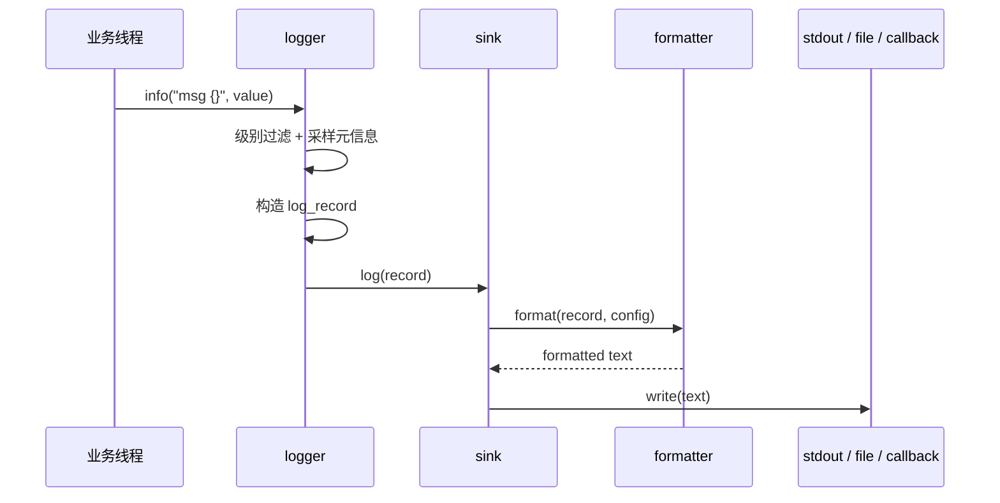
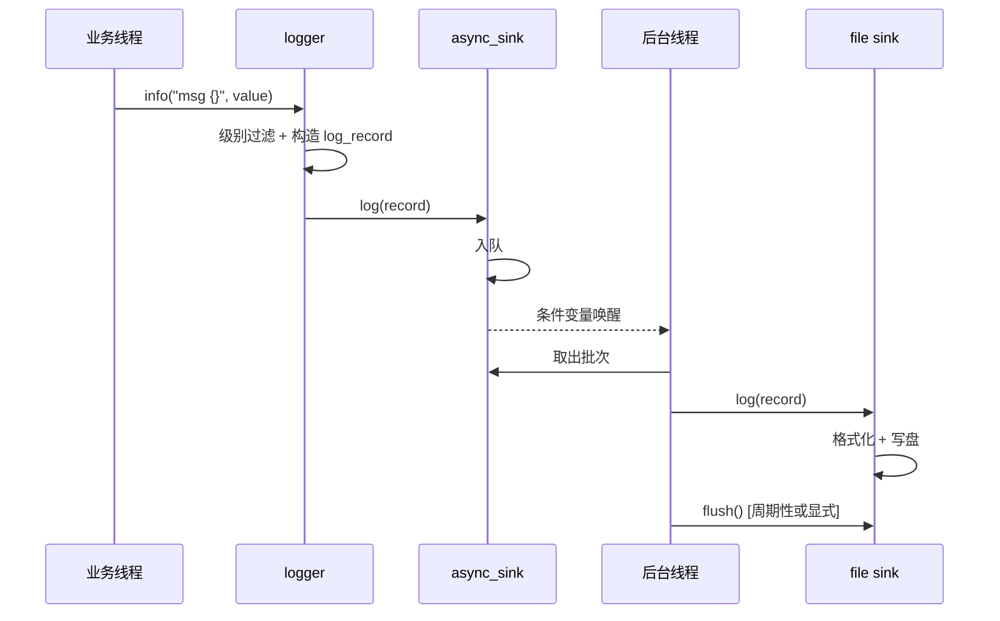
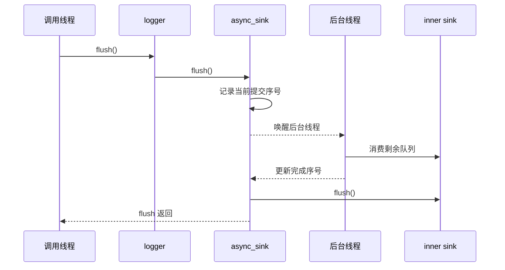

# FastLog 设计文档

## 1. 文档目标

本文档用于说明 FastLog 的整体设计思路、模块职责、关键数据流、异步文件写入架构，以及对外 API 背后的组织方式。

这份文档重点回答 5 个问题：

1. FastLog 想解决什么问题。
2. 为什么采用 `logger + sink + formatter + registry` 这样的分层结构。
3. 简洁接口和高级接口如何共用同一套底层实现。
4. 一条日志从业务线程进入系统后，最终如何到达终端、文件或回调目标。
5. 当前源码实现为什么适合在工程项目中长期使用。

## 2. 设计目标

FastLog 的目标不是“能打印日志”，而是成为一个可长期维护、可工程落地、可持续扩展的现代 C++ 日志基础设施。

核心目标如下：

### 2.1 稳定性

- 日志系统不能成为业务故障源。
- 单条日志写入失败不能拖垮整个进程。
- 异步线程必须具备可控的退出、排空和 flush 语义。

### 2.2 性能

- 业务线程的热路径尽量只做必要工作。
- 前端线程尽量不阻塞在磁盘 I/O 上。
- 多 sink 分发时避免重复采样时间、线程、调用点等元信息。

### 2.3 易用性

- 对外只暴露一个入口头：`fastlog/fastlog.hpp`。
- 基础场景下，用户应能通过极少配置直接完成控制台或文件日志接入。
- 复杂场景下，用户仍然可以获得足够强的扩展能力。

### 2.4 可扩展性

- 输出目标应可扩展到控制台、文件、轮转文件、日切文件、回调等多种 sink。
- 格式化策略应可替换，不应把固定格式写死在 logger 中。
- 异步能力应可复用，不应做成另一套平行的“异步 logger 体系”。

### 2.5 可维护性

- 各模块职责清晰，避免巨型类。
- 接口层、构造层、格式化层、输出层相互独立。
- 文档、示例、测试和设计描述保持一致。

## 3. 对外使用原则

FastLog 对外坚持两个原则：

1. 默认简单。
2. 深入可定制。

因此库对外暴露两类使用方式。

### 3.1 简洁接口

适用于基础日志输出需求：

```cpp
#include "fastlog/fastlog.hpp"

int main() {
    fastlog::set_console_level(fastlog::log_level::info);
    fastlog::set_console_detail_mode(fastlog::detail_mode::compact);
    fastlog::console.info("hello fastlog");
}
```

这一层主要提供：

- `fastlog::console`
- `fastlog::set_console_level(...)`
- `fastlog::set_console_detail_mode(...)`
- `fastlog::FileLoggerOptions`
- `fastlog::file::make_logger(...)`
- `fastlog::file::flush(...)`

### 3.2 高级接口

适用于多 sink、异步写入、自定义 pattern、自定义 sink、自定义 formatter 的场景：

```cpp
#include "fastlog/fastlog.hpp"

int main() {
    auto console_sink = fastlog::make_stdout_sink();
    auto file_sink = fastlog::make_rotating_file_sink("logs/app.log", 1024 * 1024, 5);
    auto async_file_sink = fastlog::make_async_sink(file_sink);

    auto app_logger = fastlog::create_logger(
        "app",
        {console_sink, async_file_sink},
        fastlog::log_level::debug
    );

    app_logger->info("service started");
}
```

这两层接口不是两套系统。简洁接口只是对底层能力进行预配置和封装，底层仍然共用统一的 `logger + sink + formatter + registry` 架构。

其中 `fastlog::file::make_logger(...)` 返回的是一个稳定的 `FileLogger` 句柄，而不是裸引用。这样即使 logger 被从名称注册表移除，已经分发出去的句柄也不会立刻变成悬空对象。

## 4. 代码组织

### 4.1 对外入口

- `fastlog/fastlog.hpp`

这是唯一建议用户直接包含的头文件：

```cpp
#pragma once

#include "fastlog/detail/facade.hpp"
```

这个入口头非常薄，只负责导出真正的公开能力，不让用户直接感知内部文件拆分细节。

### 4.2 内部模块

内部实现集中在 `fastlog/detail/`：

- `types.hpp`
  基础枚举、配置对象、日志记录结构、共享类型别名。
- `support.hpp`
  时间格式化、路径格式化、线程与进程信息采样、辅助格式化工具。
- `formatter.hpp`
  `formatter` 抽象接口与 `pattern_formatter` 默认实现。
- `sink.hpp`
  sink 抽象基类，统一输出前的过滤、格式化和 flush 行为。
- `sinks.hpp`
  具体 sink 实现，包括控制台、回调、基础文件、轮转文件、按天切分文件和异步包装。
- `logger.hpp`
  前端日志器实现，负责构造 `log_record` 并分发到一个或多个 sink。
- `registry.hpp`
  默认 logger 与命名 logger 管理中心。
- `stacktrace.hpp`
  栈追踪、异常辅助输出相关能力。
- `facade.hpp`
  对外的简洁 console/file 接口封装。

### 4.3 源码依赖主干

从源码依赖关系上看，FastLog 的主干是这样串起来的：

```text
fastlog/fastlog.hpp
  -> fastlog/detail/facade.hpp
      -> stacktrace.hpp
          -> registry.hpp
              -> logger.hpp
                  -> sink.hpp
                      -> formatter.hpp
                          -> support.hpp
                              -> types.hpp
              -> sinks.hpp
```

这条链路体现了一个很明确的设计意图：

- `types.hpp` 提供最基础的数据和配置定义。
- `support.hpp` 提供时间、路径、异常、格式串包装等支撑能力。
- `formatter.hpp` 建立“结构化记录 -> 最终文本”的渲染层。
- `sink.hpp` 建立统一输出抽象。
- `logger.hpp` 建立前端记录构造和分发逻辑。
- `registry.hpp` 建立全局管理能力。
- `facade.hpp` 在最外层把高级能力折叠成简单接口。

## 5. 整体架构

### 5.1 架构图


### 5.2 架构分层说明

整体上，FastLog 可以分为 5 层：

#### 5.2.1 业务层

业务代码、工具程序、测试程序通过简单接口或高级接口进入日志系统。

#### 5.2.2 接入层

接入层分为三类入口：

- 控制台入口
- 文件入口
- 高级自定义入口

它们的职责是把用户的使用意图转换成统一的 logger/sink 组合方式。

#### 5.2.3 核心引擎层

核心引擎由三部分组成：

- `registry`
- `logger`
- `formatter`

职责划分如下：

- `registry` 负责组织和管理 logger。
- `logger` 负责构造 `log_record` 并进行多 sink 分发。
- `formatter` 负责把结构化日志记录渲染为最终文本。

#### 5.2.4 输出通道层

输出通道层负责把日志送往不同输出目标：

- 同步输出通道
- 异步输出通道

异步输出并不是另一种 logger，而是对 sink 的包装层。

#### 5.2.5 输出目标层

输出目标层是最终落地点：

- 终端输出
- 文件输出
- 回调输出

文件输出进一步细分为：

- 基础文件 sink
- 轮转文件 sink
- 按天切分文件 sink

## 6. 核心对象与职责边界

### 6.1 registry

`registry` 是日志器管理中心，负责全局组织，不负责具体 I/O。

主要职责：

- 创建命名 logger
- 提供默认 logger
- 查找 logger
- 删除 logger
- 批量 flush

### 6.2 logger

`logger` 是前端入口，不是底层输出对象。

它的职责只有 5 件事：

1. 做 logger 级别过滤。
2. 采样时间、线程、进程、源码位置等元信息。
3. 格式化业务日志正文。
4. 构造统一的 `log_record`。
5. 把记录分发给一个或多个 sink。

### 6.3 formatter

`formatter` 是格式化策略接口，决定 `log_record` 如何被渲染为文本。

当前默认实现是 `pattern_formatter`，它支持两种使用方式：

- 使用统一预设的 `compact / standard / full`
- 使用完全自定义的 pattern

### 6.4 sink

sink 是真正的输出终点。

它决定：

- 采用哪种 formatter
- 输出到哪里
- 是否需要颜色
- 是否需要文件轮转
- 是否需要按天切分
- 是否采用同步还是异步

### 6.5 async_sink

`async_sink` 是对真实 sink 的包装器，而不是另一种 logger。

这意味着：

- 同一个 logger 可以同时拥有同步 console sink 和异步 file sink。
- 下游是 `basic_file_sink`、`rotating_file_sink`、`daily_file_sink` 还是 callback sink，对异步层来说没有本质差别。
- 业务线程与慢 I/O 解耦。

## 7. 源码实现剖析

这一章不再只讲“设计上希望怎样”，而是直接落到当前源码的关键实现。

### 7.1 单入口头为什么能成立

对外入口 [fastlog.hpp](/Users/lxh/workspace/cpp/FastLog/fastlog/fastlog.hpp) 非常薄：

```cpp
#pragma once

#include "fastlog/detail/facade.hpp"
```

这意味着：

- 用户只需要 include 一个头。
- 真正的公开 API 都由 `facade.hpp` 汇总导出。
- 内部模块拆分不会污染用户侧使用体验。

### 7.2 `types.hpp`：整个系统的数据基座

[types.hpp](/Users/lxh/workspace/cpp/FastLog/fastlog/detail/types.hpp) 里最重要的不是枚举本身，而是两个核心结构：

- `format_config`
- `log_record`

#### 7.2.1 `format_config`

`format_config` 是格式控制中心。它把“日志长什么样”统一收敛成一个对象，而不是把这些开关散落在 logger、sink、formatter 各处。

```cpp
struct format_config {
  detail_mode detail{detail_mode::compact};
  bool show_timestamp{true};
  bool timestamp_with_microseconds{false};
  bool show_level{true};
  bool show_logger_name{false};
  bool show_thread_id{false};
  bool show_process_id{false};
  bool show_source_location{false};
  bool colorize{false};
  time_mode clock_mode{time_mode::local};
  source_path_mode source_path{source_path_mode::filename};
};
```

它的设计意义在于：

- `compact / standard / full` 只是预设，不是硬编码格式。
- 终端和文件共用同一种配置模型。
- pattern formatter 和默认 formatter 都围绕同一个配置对象工作。

#### 7.2.2 `log_record`

`log_record` 是系统内部最关键的中间对象：

```cpp
struct log_record {
  std::string logger_name;
  log_level level{log_level::info};
  std::chrono::system_clock::time_point timestamp{std::chrono::system_clock::now()};
  std::uint64_t thread_id{0};
  std::uint32_t process_id{0};
  std::source_location location{};
  bool force_source_location{false};
  std::string message;
};
```

这说明当前架构不是“边采样边输出”，而是：

1. 先把日志采样成标准记录对象。
2. 再让 formatter 和 sink 消费这个标准对象。

### 7.3 `support.hpp`：把高频公共逻辑收口

[support.hpp](/Users/lxh/workspace/cpp/FastLog/fastlog/detail/support.hpp) 解决的是“很多模块都会用，但又不该散落实现”的问题。

这里最关键的实现有 4 类。

#### 7.3.1 级别与颜色映射

```cpp
inline auto level_to_string(log_level level) -> std::string_view { ... }
inline auto level_color(log_level level) -> std::string_view { ... }
```

这样 formatter 不需要自己维护一份级别文本或颜色映射表。

#### 7.3.2 线程安全时间转换

```cpp
inline void safe_localtime(std::time_t time_value, std::tm *tm) { ... }
inline void safe_gmtime(std::time_t time_value, std::tm *tm) { ... }
```

这直接规避了传统 `std::localtime` 的线程安全问题。

#### 7.3.3 源码位置输出策略

```cpp
inline auto format_source_path(std::string_view file_name,
                               const format_config &config) -> std::string {
  if (config.source_path == source_path_mode::absolute) {
    return std::string(file_name);
  }
  const auto source = std::filesystem::path(file_name);
  return normalize_path(source.filename().generic_string());
}
```

这里清楚体现了当前源码位置策略：

- 只支持 `absolute`
- 或 `filename`

#### 7.3.4 无宏调用点捕获

```cpp
template <typename... Args>
struct format_string_with_location {
  consteval format_string_with_location(
      const T &fmt_string,
      std::source_location location = std::source_location::current())
      : fmt(fmt_string), loc(location) {}

  std::format_string<Args...> fmt;
  std::source_location loc;
};
```

这段实现的价值很高，它让 `logger.info("x = {}", x)` 这种无宏调用方式，仍然能够拿到调用点位置。

### 7.4 `formatter.hpp`：默认格式与 pattern 共用一套渲染入口

[formatter.hpp](/Users/lxh/workspace/cpp/FastLog/fastlog/detail/formatter.hpp) 的关键点是：默认格式和自定义 pattern 统一收敛到 `pattern_formatter`。

核心入口如下：

```cpp
[[nodiscard]] auto format(const log_record &record,
                          const format_config &config) const
    -> std::string override {
  if (pattern_.empty()) {
    return format_default(record, config);
  }
  return format_pattern(record, config);
}
```

#### 7.4.1 默认布局渲染

默认布局不是写死字符串，而是按 `format_config` 逐字段拼装：

```cpp
if (config.show_timestamp) { ... }
if (config.show_level) { ... }
if (config.show_logger_name) { ... }
if (config.show_thread_id) { ... }
if (config.show_process_id) { ... }
if (show_source) { ... }
text += record.message;
```

这使得：

- `compact / standard / full` 可以共享一套实现。
- 控制台和文件 sink 可以复用同一套默认渲染逻辑。
- `force_source_location` 这种异常日志行为，也能被统一处理。

#### 7.4.2 pattern 渲染

pattern 渲染当前采用轻量扫描实现：

```cpp
for (std::size_t i = 0; i < pattern_.size(); ++i) {
  if (pattern_[i] != '%') { ... }
  switch (pattern_[i]) {
  case 'v': ...
  case 'l': ...
  case 'n': ...
  case 't': ...
  case 'P': ...
  case 's': ...
  case '#': ...
  case 'Y': ...
  }
}
```

这反映了当前实现的取舍：

- 优先保证 header-only 和实现清晰。
- 不先引入复杂 token 预编译。
- 先满足常用 pattern 能力，再为后续性能优化留空间。

### 7.5 `sink.hpp`：统一输出骨架

[sink.hpp](/Users/lxh/workspace/cpp/FastLog/fastlog/detail/sink.hpp) 的核心价值在于，它把所有 sink 的公共行为抽成了统一骨架：

```cpp
virtual void log(const log_record &record) {
  if (record.level < level()) {
    return;
  }
  record_enqueue();
  auto rendered = render(record);
  sink_it(rendered);
  if (record.level >= flush_on()) {
    flush();
  }
}
```

这个骨架做了 4 件事：

1. sink 级别过滤。
2. 统计计数。
3. 调用 formatter 渲染。
4. 调用派生类实际写入。

因此派生类只需要专注一件事：怎么把已经渲染好的文本落到目标介质。

### 7.6 `logger.hpp`：真正的前端热路径

[logger.hpp](/Users/lxh/workspace/cpp/FastLog/fastlog/detail/logger.hpp) 是整个系统最核心的前端实现。

#### 7.6.1 统一入口

快捷接口最终都会汇聚到：

```cpp
template <typename... Args>
void log(log_level level_value, detail::format_string<Args...> fmt,
         Args &&...args) {
  log_with_location(level_value, fmt.loc, fmt.fmt, std::forward<Args>(args)...);
}
```

这说明：

- `trace/debug/info/warn/error/fatal` 只是轻量包装。
- 真正核心逻辑集中在 `log_with_location(...)`。

#### 7.6.2 热路径剖析

```cpp
if (level_value < level()) {
  return;
}

log_record record{
    .logger_name = name_,
    .level = level_value,
    .timestamp = std::chrono::system_clock::now(),
    .thread_id = detail::current_thread_id(),
    .process_id = detail::current_process_id(),
    .location = location,
    .force_source_location = false,
    .message = detail::format_message(fmt, std::forward<Args>(args)...)};

remember_backtrace(record);
dispatch(record);
```

这里体现了前端路径的设计顺序：

1. 先级别过滤，避免无意义格式化。
2. 一次性构造完整 `log_record`。
3. 可选写入 backtrace ring buffer。
4. 分发给所有 sink。

#### 7.6.3 backtrace 实现方式

backtrace 不是另起一套日志系统，而是 logger 内部维护了一个最近消息缓冲：

```cpp
std::deque<log_record> backtrace_buffer_;
std::size_t backtrace_capacity_{0};
bool backtrace_enabled_{false};
```

配合：

- `enable_backtrace(...)`
- `disable_backtrace()`
- `flush_backtrace()`

就构成了当前的 ring buffer 方案。

### 7.7 `registry.hpp`：默认 logger 与命名 logger 的组织中心

[registry.hpp](/Users/lxh/workspace/cpp/FastLog/fastlog/detail/registry.hpp) 做的是“组织”而不是“输出”。

最关键的一段在构造函数：

```cpp
registry() {
  auto stdout_sink_ptr = make_stdout_sink();
  auto config = stdout_sink_ptr->format_config_value();
  detail::apply_detail_mode_preset(&config, detail_mode::compact);
  config.colorize = true;
  stdout_sink_ptr->set_format_config(config);
  console_logger_ = std::make_shared<logger>(
      "console", std::vector<sink_ptr>{stdout_sink_ptr}, log_level::info);
  default_logger_ = console_logger_;
}
```

这段代码做了两件很重要的事：

1. 库启动后就准备好了可用的控制台 logger。
2. 默认 logger 和 console logger 默认指向同一个对象。

### 7.8 `facade.hpp`：简洁接口不是另写一套系统

[facade.hpp](/Users/lxh/workspace/cpp/FastLog/fastlog/detail/facade.hpp) 里最关键的实现，是 `simple_file_logger_registry`。

它的核心装配路径如下：

```cpp
auto rotating =
    std::make_shared<rotating_file_sink>(log_path, rotating_options);
apply_format(rotating, options);

sink_ptr sink_ptr_value = rotating;
std::shared_ptr<async_sink> async;
if (options.async_write) {
  async = std::make_shared<async_sink>(rotating, async_options{...});
  sink_ptr_value = async;
}

auto logger_ptr_value =
    create_logger(logger_name, {sink_ptr_value}, options.level);
```

这段源码说明：

- 简单接口只是做预装配。
- 底层仍旧复用统一的 sink / logger / registry 结构。
- 没有退化成另一套独立的文件日志实现。

### 7.9 `sinks.hpp`：异步 sink 的核心源码剖析

[sinks.hpp](/Users/lxh/workspace/cpp/FastLog/fastlog/detail/sinks.hpp) 里最值得深入分析的是 `async_sink`。

#### 7.9.1 前端入队逻辑

```cpp
std::unique_lock lock(queue_mutex_);
if (options_.policy == overflow_policy::block) {
  queue_not_full_.wait(lock, [this] {
    return shutdown_requested_ || queue_.size() < options_.queue_size;
  });
} else if (queue_.size() >= options_.queue_size) {
  if (options_.policy == overflow_policy::drop_new) {
    record_drop();
    return;
  }
  if (options_.policy == overflow_policy::drop_oldest && !queue_.empty()) {
    queue_.pop_front();
    record_drop();
  }
}

if (shutdown_requested_) {
  return;
}

queue_.push_back(record);
record_enqueue();
submitted_sequence_.fetch_add(1, std::memory_order_relaxed);
```

这里把异步日志前端最关键的三件事做清楚了：

- 队列满时怎么办
- shutdown 时怎么办
- flush 如何知道哪些消息已经处理完成

#### 7.9.2 后台线程主循环

```cpp
std::deque<log_record> batch;
{
  std::unique_lock lock(queue_mutex_);
  queue_not_empty_.wait_until(lock, next_flush_deadline, [this] {
    return shutdown_requested_.load() || !queue_.empty();
  });

  if (queue_.empty() && shutdown_requested_) {
    break;
  }

  batch.swap(queue_);
  queue_not_full_.notify_all();
}

for (const auto &record : batch) {
  try {
    inner_sink_->log(record);
  } catch (...) {
  }
  completed_sequence_.fetch_add(1, std::memory_order_relaxed);
}
```

这段实现体现了两个很好的工程习惯：

1. 队列交换在锁内，I/O 在锁外。
2. 下游 sink 抛异常时后台线程不会直接崩掉。

#### 7.9.3 可等待 flush 语义

```cpp
std::uint64_t target_sequence = 0;
{
  std::lock_guard lock(queue_mutex_);
  target_sequence = submitted_sequence_.load(std::memory_order_relaxed);
}
queue_not_empty_.notify_one();
{
  std::unique_lock lock(queue_mutex_);
  queue_drained_.wait(lock, [this, target_sequence] {
    return completed_sequence_.load(std::memory_order_relaxed) >=
               target_sequence &&
           queue_.empty();
  });
}
inner_sink_->flush();
```

这段代码决定了：

- `logger.flush()` 不是“我已经通知后台线程了”
- 而是“flush 之前提交的日志都处理完了”

## 8. 关键数据结构

### 8.1 log_record

`log_record` 是整个系统的标准中间对象。

典型字段包括：

- 时间戳
- 日志级别
- logger 名称
- 线程 ID
- 进程 ID
- 源文件与行号
- 消息正文

之所以要统一成一个中间对象，是因为：

1. 多 sink 分发时，元信息只采样一次。
2. formatter 不需要理解业务格式参数。
3. 异步队列中传递的是稳定对象，而不是未完成格式化的参数包。
4. 新 sink 或新 formatter 可以直接围绕 `log_record` 扩展。

### 8.2 format_config

`format_config` 是输出样式控制中心。

它管理：

- `compact / standard / full`
- 是否显示 logger 名称
- 是否显示线程/进程信息
- 是否显示源码位置
- 源码位置使用 `filename` 还是 `absolute`

### 8.3 FileLoggerOptions

`FileLoggerOptions` 是简洁文件接口的配置对象。

它把用户常用选项集中在一个结构体里，例如：

- 日志级别
- 输出模式
- 源码位置模式
- 文件大小阈值
- 轮转文件数量
- 是否异步写入

## 9. 核心日志流程

### 9.1 同步日志路径

当业务代码执行：

```cpp
fastlog::console.info("user {} logged in", user_id);
```

系统内部会经历如下阶段：

1. 进入 `logger::info(...)`
2. 转发到统一的 `logger::log(...)`
3. 做 logger 级别过滤
4. 采样时间、线程、进程、源码位置
5. 使用 `std::format` 渲染消息正文
6. 构造 `log_record`
7. 将 `log_record` 分发到对应 sink
8. sink 调用 formatter 渲染最终文本
9. sink 把文本写入终端、文件或回调目标

### 9.2 时序图：同步输出



### 9.3 时序图：异步文件写入



### 9.4 时序图：显式 flush



## 10. 文件写入设计

### 10.1 basic_file_sink

`basic_file_sink` 直接面向单文件输出。

写入流程：

1. 初始化时打开文件。
2. 收到 `log_record` 后格式化为文本。
3. 将文本写入文件流。
4. 满足 flush 条件时执行 flush。

### 10.2 rotating_file_sink

`rotating_file_sink` 在基础文件 sink 的能力上增加大小轮转。

逻辑流程：

1. 收到日志后先判断写入后的预估文件大小。
2. 如果超过阈值，则执行轮转。
3. 轮转时依次处理旧文件编号。
4. 重新打开主文件继续写入。

### 10.3 daily_file_sink

`daily_file_sink` 按天切分输出文件。

逻辑流程：

1. 根据当前时间和轮转时间点计算当前周期键。
2. 若周期键变化，则关闭旧文件。
3. 打开新周期对应的文件。
4. 后续日志写入新文件。

### 10.4 async_sink 的写入流程

异步写入的关键不在“起一个线程”，而在“让前端、队列、后台消费、flush、关闭流程之间行为一致”。

#### 10.4.1 前端线程

前端线程在调用 `async_sink::log(...)` 时主要做以下工作：

1. 获取队列锁。
2. 判断队列是否已满。
3. 根据溢出策略处理：
   - `block`
   - `drop_oldest`
   - `drop_new`
4. 将 `log_record` 放入队列。
5. 更新统计信息。
6. 唤醒后台线程。

#### 10.4.2 后台线程

后台线程负责：

1. 等待“有日志可消费”或“需要周期 flush”的条件。
2. 把共享队列中的数据批量转移到本地批次。
3. 锁外调用真实 sink 的 `log(...)`。
4. 更新消费完成序号。
5. 在合适时机调用下游 sink 的 `flush()`。
6. 退出前排空剩余日志。

#### 10.4.3 为什么 flush 必须可等待

对工程项目来说，`flush()` 的意义不是“发出一个刷新请求”，而是“确保 flush 返回前，之前提交的日志已经真正刷到下游 sink”。

因此当前实现采用了“提交序号 / 完成序号”这一类同步语义，使显式 flush 具备可靠的可等待行为。

## 11. 设计模式

### 11.1 Facade

`fastlog/fastlog.hpp` 是整体对外门面。  
`console` 和 `file` 这套基础接口又构成了第二层轻量门面。

### 11.2 Strategy

`formatter` 是典型策略接口。

### 11.3 Decorator

`async_sink` 是典型装饰器，它不改变下游 sink 的职责，只是在前后端之间插入队列和后台线程。

### 11.4 Registry

`registry` 是对象管理中心，负责统一发现和组织 logger，而不是承担输出工作。

### 11.5 Template Method 风格

sink 抽象基类提供统一骨架：

1. 级别过滤
2. 调用 formatter
3. 调用派生 sink 的实际输出逻辑
4. 按 flush 策略执行 flush

## 12. 关键代码片段

### 12.1 基础控制台输出

```cpp
fastlog::set_console_level(fastlog::log_level::debug);
fastlog::set_console_detail_mode(fastlog::detail_mode::standard);
fastlog::console.info("http server started on {}", 8080);
```

### 12.2 基础文件输出

```cpp
fastlog::FileLoggerOptions options{
    .level = fastlog::log_level::info,
    .detail_mode = fastlog::detail_mode::compact,
    .source_path = fastlog::source_path_mode::filename,
    .max_file_size = 2 * 1024 * 1024,
    .max_files = 3,
    .async_write = true
};

auto app_logger = fastlog::file::make_logger("app", "logs/app.log", options);
app_logger.warn("disk usage is high: {}%", 87);
fastlog::file::flush(app_logger);
```

### 12.3 自定义 pattern

```cpp
auto sink = fastlog::make_stdout_sink();
sink->set_pattern("%Y-%m-%d %H:%M:%S [%l] [%n] %v");

auto logger = fastlog::create_logger(
    "demo",
    {sink},
    fastlog::log_level::trace
);

logger->info("custom pattern enabled");
```

### 12.4 多 sink 组合

```cpp
auto console_sink = fastlog::make_stdout_sink();
auto rotating_sink = fastlog::make_rotating_file_sink("logs/server.log", 8 * 1024 * 1024, 5);
auto async_rotating_sink = fastlog::make_async_sink(rotating_sink);

auto logger = fastlog::create_logger(
    "server",
    {console_sink, async_rotating_sink},
    fastlog::log_level::debug
);

logger->error("database connection lost");
```

## 13. 核心源码摘录与逐段解析

这一节直接摘录当前项目里的关键源码，并说明它们在系统中的作用。这里不追求把所有实现完整贴一遍，而是把真正决定架构行为的核心片段贴出来。

### 13.1 `logger` 的统一日志入口

文件：[logger.hpp](/Users/lxh/workspace/cpp/FastLog/fastlog/detail/logger.hpp)

```cpp
template <typename... Args>
void log(log_level level_value, detail::format_string<Args...> fmt,
         Args &&...args) {
  log_with_location(level_value, fmt.loc, fmt.fmt, std::forward<Args>(args)...);
}
```

这段代码说明：

- 所有快捷接口最终都会汇聚到统一入口。
- `format_string` 不只带格式串，还带 `source_location`。
- logger 前端不会在多个入口里重复维护同一套日志构造逻辑。

### 13.2 `logger` 热路径：构造 `log_record`

文件：[logger.hpp](/Users/lxh/workspace/cpp/FastLog/fastlog/detail/logger.hpp)

```cpp
template <typename... Args>
void log_with_location(log_level level_value, std::source_location location,
                       std::format_string<Args...> fmt, Args &&...args) {
  if (level_value < level()) {
    return;
  }

  log_record record{
      .logger_name = name_,
      .level = level_value,
      .timestamp = std::chrono::system_clock::now(),
      .thread_id = detail::current_thread_id(),
      .process_id = detail::current_process_id(),
      .location = location,
      .force_source_location = false,
      .message = detail::format_message(fmt, std::forward<Args>(args)...)};

  remember_backtrace(record);
  dispatch(record);
}
```

这段代码是整个系统最核心的前端路径：

1. 先做 logger 级别过滤。
2. 一次性采齐时间、线程、进程、源码位置。
3. 把正文和元信息装配成稳定的 `log_record`。
4. 先进入 backtrace，再统一分发到 sink。

### 13.3 `sink` 的统一输出骨架

文件：[sink.hpp](/Users/lxh/workspace/cpp/FastLog/fastlog/detail/sink.hpp)

```cpp
virtual void log(const log_record &record) {
  if (record.level < level()) {
    return;
  }
  record_enqueue();
  auto rendered = render(record);
  sink_it(rendered);
  if (record.level >= flush_on()) {
    flush();
  }
}
```

这一段是所有 sink 共享的模板骨架：

- 先做 sink 自身级别过滤
- 记录统计
- 调用 formatter 渲染文本
- 调用派生类 `sink_it(...)` 执行真正落地
- 按级别决定是否自动 flush

也就是说，具体 sink 只需要关心“如何写”，不需要关心“是否应该写、怎么格式化、是否要统计”。

### 13.4 默认 formatter 的字段拼装

文件：[formatter.hpp](/Users/lxh/workspace/cpp/FastLog/fastlog/detail/formatter.hpp)

```cpp
if (config.show_timestamp) {
  append_prefix(detail::make_timestamp(record.timestamp, config.clock_mode, false,
                                       config.timestamp_with_microseconds));
}
if (config.show_level) {
  if (config.colorize) {
    append_prefix(std::format("[{}{}{}]", detail::level_color(record.level),
                              detail::level_to_string(record.level),
                              detail::reset_color()));
  } else {
    append_prefix(std::format("[{}]", detail::level_to_string(record.level)));
  }
}
if (config.show_logger_name) {
  append_prefix(std::format("[{}]", record.logger_name));
}
if (config.show_thread_id) {
  append_prefix(std::format("[tid:{}]", record.thread_id));
}
if (config.show_process_id) {
  append_prefix(std::format("[pid:{}]", record.process_id));
}
```

这段代码体现了默认 formatter 的设计原则：

- 默认模式不是写死一整条字符串模板。
- 而是根据 `format_config` 做按字段拼接。
- 因此 `compact / standard / full` 都能共享这套实现。

### 13.5 源码位置输出策略

文件：[support.hpp](/Users/lxh/workspace/cpp/FastLog/fastlog/detail/support.hpp)

```cpp
inline auto format_source_path(std::string_view file_name,
                               const format_config &config) -> std::string {
  if (config.source_path == source_path_mode::absolute) {
    return std::string(file_name);
  }
  const auto source = std::filesystem::path(file_name);
  return normalize_path(source.filename().generic_string());
}
```

这段源码直接定义了当前源码位置的行为边界：

- `absolute` 时输出完整绝对路径
- 否则输出纯文件名

这也和现在对外暴露的两种源码位置模式完全一致。

### 13.6 无宏 `source_location` 捕获

文件：[support.hpp](/Users/lxh/workspace/cpp/FastLog/fastlog/detail/support.hpp)

```cpp
template <typename... Args>
struct format_string_with_location {
  template <typename T>
    requires std::convertible_to<T, std::string_view>
  consteval format_string_with_location(
      const T &fmt_string,
      std::source_location location = std::source_location::current())
      : fmt(fmt_string), loc(location) {}

  std::format_string<Args...> fmt;
  std::source_location loc;
};
```

这一段决定了 FastLog 能在不依赖宏的前提下，把调用点一起带进 logger 前端。

它解决的问题是：

- 用户想写 `logger.info("x={}", x)`
- 但又希望日志里能自动拿到源码位置

### 13.7 `registry` 默认控制台 logger 的建立

文件：[registry.hpp](/Users/lxh/workspace/cpp/FastLog/fastlog/detail/registry.hpp)

```cpp
registry() {
  auto stdout_sink_ptr = make_stdout_sink();
  auto config = stdout_sink_ptr->format_config_value();
  detail::apply_detail_mode_preset(&config, detail_mode::compact);
  config.colorize = true;
  stdout_sink_ptr->set_format_config(config);
  console_logger_ = std::make_shared<logger>(
      "console", std::vector<sink_ptr>{stdout_sink_ptr}, log_level::info);
  default_logger_ = console_logger_;
}
```

这段代码说明：

- FastLog 初始化时就准备好了一个可直接使用的控制台 logger。
- 默认 logger 与 console logger 默认共用同一个实例。
- 这正是 `fastlog::console.info(...)` 能开箱即用的根源。

### 13.8 简洁文件接口的装配过程

文件：[facade.hpp](/Users/lxh/workspace/cpp/FastLog/fastlog/detail/facade.hpp)

```cpp
auto rotating =
    std::make_shared<rotating_file_sink>(log_path, rotating_options);
apply_format(rotating, options);

sink_ptr sink_ptr_value = rotating;
std::shared_ptr<async_sink> async;
if (options.async_write) {
  async = std::make_shared<async_sink>(
      rotating,
      async_options{.queue_size = options.queue_size,
                    .policy = options.overflow,
                    .flush_interval = options.flush_interval});
  sink_ptr_value = async;
}

auto logger_ptr_value =
    create_logger(logger_name, {sink_ptr_value}, options.level);
```

这段源码很关键，因为它直接证明：

- 简洁文件接口不是单独重写的一套文件 logger 系统。
- 它本质上是在帮用户预装配 `rotating_file_sink + 可选 async_sink + logger`。
- 高级架构和基础接口复用的是同一套底层对象。

### 13.9 异步 sink 前端入队逻辑

文件：[sinks.hpp](/Users/lxh/workspace/cpp/FastLog/fastlog/detail/sinks.hpp)

```cpp
std::unique_lock lock(queue_mutex_);
if (options_.policy == overflow_policy::block) {
  queue_not_full_.wait(lock, [this] {
    return shutdown_requested_ || queue_.size() < options_.queue_size;
  });
} else if (queue_.size() >= options_.queue_size) {
  if (options_.policy == overflow_policy::drop_new) {
    record_drop();
    return;
  }
  if (options_.policy == overflow_policy::drop_oldest && !queue_.empty()) {
    queue_.pop_front();
    record_drop();
  }
}

if (shutdown_requested_) {
  return;
}

queue_.push_back(record);
record_enqueue();
submitted_sequence_.fetch_add(1, std::memory_order_relaxed);
```

这一段是异步前端最关键的代码，核心处理了：

- 队列满时三种不同策略
- shutdown 状态下的拒绝写入
- 提交序号的推进

### 13.10 异步 sink 后台消费循环

文件：[sinks.hpp](/Users/lxh/workspace/cpp/FastLog/fastlog/detail/sinks.hpp)

```cpp
std::deque<log_record> batch;
{
  std::unique_lock lock(queue_mutex_);
  queue_not_empty_.wait_until(lock, next_flush_deadline, [this] {
    return shutdown_requested_.load() || !queue_.empty();
  });

  if (queue_.empty() && shutdown_requested_) {
    break;
  }

  batch.swap(queue_);
  queue_not_full_.notify_all();
}

for (const auto &record : batch) {
  try {
    inner_sink_->log(record);
  } catch (...) {
  }
  completed_sequence_.fetch_add(1, std::memory_order_relaxed);
}
```

这里体现了异步写入实现的两个关键点：

- 队列交换发生在锁内，真实 I/O 发生在锁外
- 后台线程吞掉单条日志异常，避免日志系统自身把进程带崩

### 13.11 可等待 `flush()` 的实现

文件：[sinks.hpp](/Users/lxh/workspace/cpp/FastLog/fastlog/detail/sinks.hpp)

```cpp
std::uint64_t target_sequence = 0;
{
  std::lock_guard lock(queue_mutex_);
  target_sequence = submitted_sequence_.load(std::memory_order_relaxed);
}
queue_not_empty_.notify_one();
{
  std::unique_lock lock(queue_mutex_);
  queue_drained_.wait(lock, [this, target_sequence] {
    return completed_sequence_.load(std::memory_order_relaxed) >=
               target_sequence &&
           queue_.empty();
  });
}
inner_sink_->flush();
```

这段实现决定了当前 `flush()` 的语义不是“尽快刷新”，而是：

- 等待 flush 之前已入队的数据全部被消费
- 然后再调用下游 sink 的真正 flush

## 14. 相关文档

- [README](../readme.md)
- [架构图 SVG](./fastlog-architecture.svg)
- [基础示例](../example/simple_example.cpp)
- [高级示例](../example/advanced_example.cpp)
