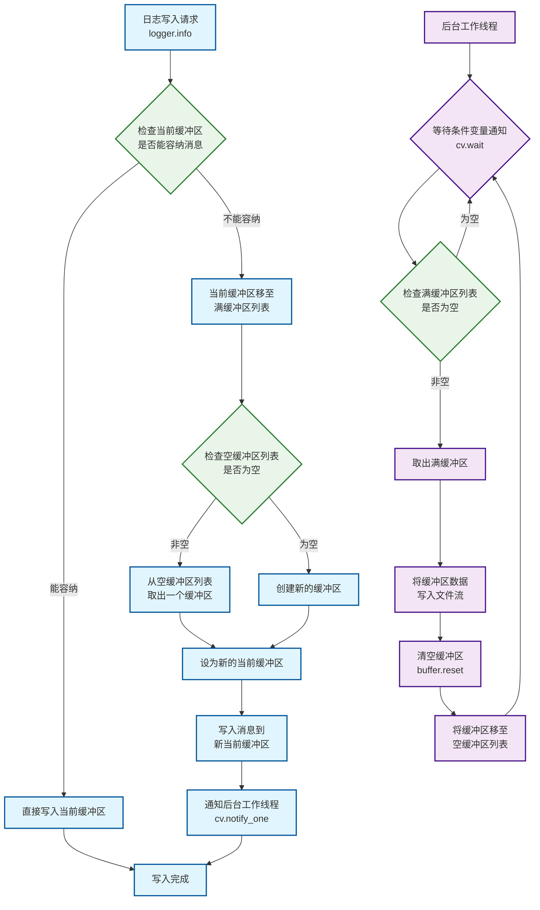
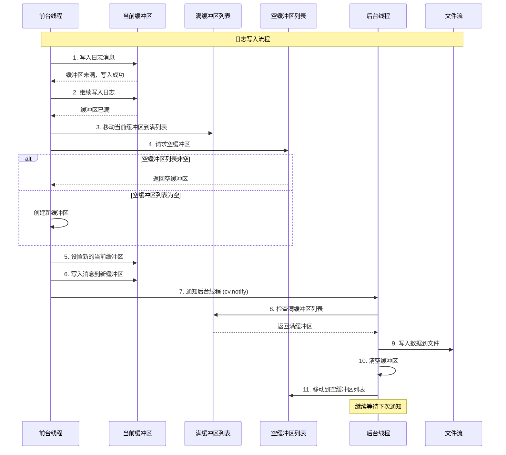

# FastLog - 高性能C++日志系统

## 项目介绍

FastLog是一个基于现代C++23标准开发的高性能日志系统。该系统采用异步写入策略和高效的内存管理，提供了控制台日志和文件日志两种输出方式，支持多线程环境下的高并发日志记录。

## 环境要求

- **编译器**: 支持C++23的编译器 (GCC 13+, Clang 16+)
- **操作系统**: Linux/macOS
- **构建工具**: CMake 3.10+

## 快速开始

### 基本使用

```cpp
#include "fastlog/fastlog.hpp"

int main() {
    // 控制台日志
    fastlog::console.info("Hello, FastLog! Value: {}", 42);
    fastlog::console.warn("This is a warning");
    fastlog::console.error("This is an error");
  
    // 文件日志
    auto& logger = fastlog::file::make_logger("app_log", "application", "./logs");
    logger.info("Application started, user_id: {}", 12345);
    logger.debug("Debug information: {}", "some_data");
    fastlog::file::get_logger("app_log")->info("hello world");
    return 0;
}
```

## 核心类功能介绍

### LogBuffer (FileLogBuffer)

高效的日志缓冲区实现，基于 `std::array`封装：

- **模板化设计**: 支持编译时指定缓冲区大小
- **零拷贝写入**: 直接在缓冲区内构造日志数据
- **内存安全**: 提供边界检查和容量管理
- **高性能**: 基于连续内存，缓存友好

### logfstream

文件流封装类，提供高级文件操作功能：

- **自动目录创建**: 自动创建日志目录结构
- **文件轮转**: 支持基于文件大小的自动轮转
- **缓冲优化**: 自定义文件流缓冲区大小
- **异常安全**: 提供完整的错误处理机制

### BaseLogger (CRTP基类)

基于CRTP(Curiously Recurring Template Pattern)的日志器基类：

- **编译时多态**: 避免虚函数调用开销
- **类型安全**: 编译时格式字符串检查
- **日志级别**: 支持Debug、Info、Warn、Error四个级别
- **源码定位**: 自动记录调用位置信息

### ConsoleLogger

控制台日志器实现：

- **单例模式**: 全局唯一实例
- **彩色输出**: 支持不同日志级别的颜色区分
- **线程安全**: 内置同步机制
- **即时输出**: 日志立即输出到控制台

### FileLogger

文件日志器实现：

- **异步写入**: 后台线程处理文件I/O操作
- **双缓冲机制**: 前台写入，后台刷盘
- **内存池**: 缓冲区复用，减少内存分配
- **优雅关闭**: 确保所有日志数据完整写入

## 核心技术点

### 1. logfstream封装

对标准文件流进行了高级封装，提供了以下增强功能：

- **智能目录管理**: 自动创建日志目录层次结构
- **文件轮转策略**: 基于文件大小的自动轮转，防止单个文件过大
- **缓冲区优化**: 自定义缓冲区大小，提升I/O性能
- **时间戳命名**: 自动为轮转文件添加时间戳后缀

### 2. CRTP (Curiously Recurring Template Pattern)

使用CRTP模式实现编译时多态：

```cpp
template <typename DerviceLogger> 
class BaseLogger {
    template <LogLevel LEVEL, typename... Args>
    void format(format_string_wrapper<Args...> fmt_w, Args &&...args) {
        // 调用派生类的log方法
        static_cast<DerviceLogger *>(this)->template log<LEVEL>(record);
    }
};
```

**优势**:

- 零运行时开销的多态
- 编译时类型检查
- 更好的内联优化机会

### 3. 日志格式化参数类封装

```cpp
template <typename... Args> 
struct basic_format_string_wrapper {
  template <typename T>
    requires std::convertible_to<T, std::string_view>
  consteval basic_format_string_wrapper(
      const T &s, std::source_location loc = std::source_location::current())
      : fmt(s), loc(loc) {}
  
  std::format_string<Args...> fmt;  // C++20的编译时格式字符串检查
  std::source_location loc;         // 自动捕获调用位置
};
```

- 使用`consteval` - 构造函数在编译时执行，确保格式字符串在编译时就被验证
- 使用 `std::format_string<Args...>` - 确保格式字符串中的占位符与参数类型匹配，不匹配会编译错误
- 使用 `std::source_location::current()` - 自动获取调用日志函数的确切位置
- 使用 `std::type_identity_t<Args>...` - 避免类型推导

### 4. 文件异步写入策略

采用生产者-消费者模式实现高性能异步写入：

**架构设计**:





**核心机制**:

- **双缓冲设计**: 前台写入当前缓冲区，后台处理满缓冲区
- **缓冲区池**: 复用缓冲区对象，减少内存分配开销
- **优雅关闭**: 确保程序退出时所有日志完整写入


