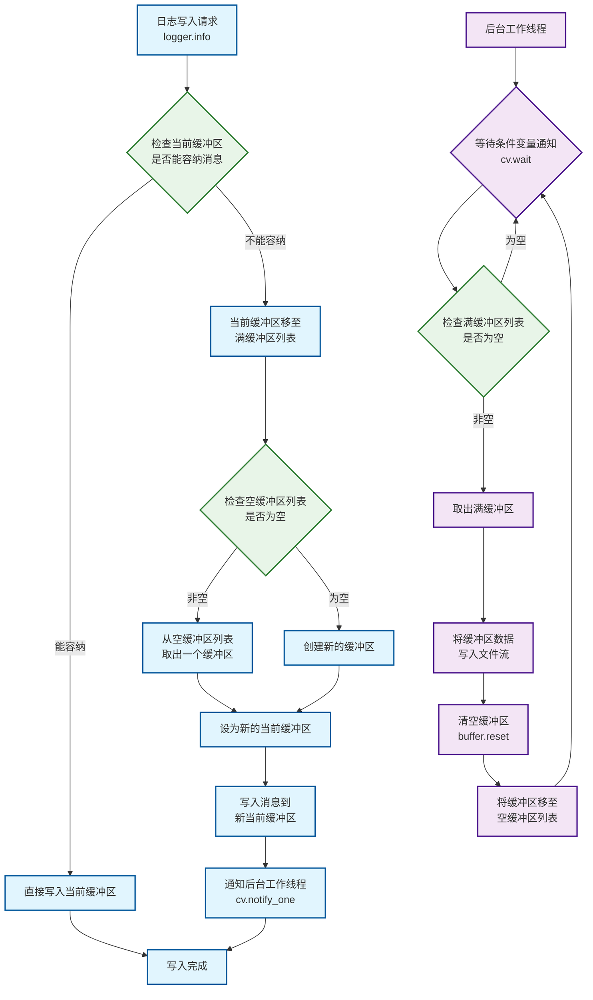
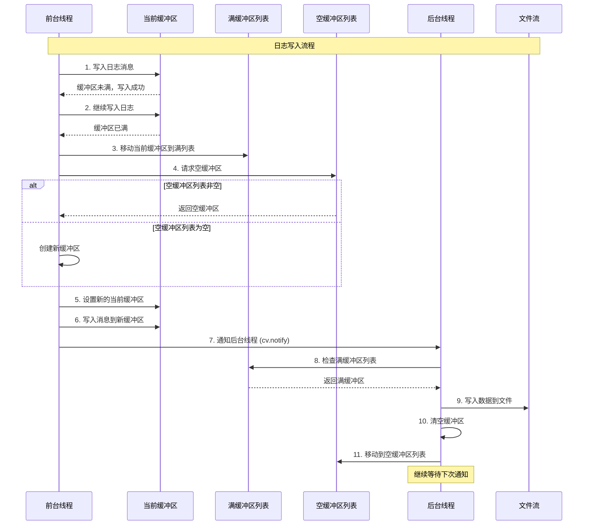

# FastLog - 高性能C++日志系统

## 项目介绍

FastLog 是一个基于现代 C++23 标准开发的日志库，当前支持：

- 控制台日志和异步文件日志
- 终端默认精简输出：时间 + 级别 + 线程 + 日志正文
- 文件默认全量输出：额外附带源文件和行号
- 基于 `cpptrace` 的栈回溯与异常调用栈打印
- 终端和文件 logger 都支持分别设置最小日志级别
- 文件 logger 支持 detail mode、最大文件大小配置


## 使用的C++库特性
- C++11 `std::array` `std::thread` `std::mutex` `std::condition_variable`
- C++17 `std::optional` `std::string_view` `std::filesystem`
- C++20 `std::format` `std::source_location` `concepts`
- C++23 `std::print`


## 环境要求

- **编译器**: 支持C++23的编译器
- **操作系统**: Linux/macOS/Windows
- **构建工具**: CMake 

## 快速开始

### 基本使用

```cpp
#include "fastlog/fastlog.hpp"

int main() {
    // 终端 logger：默认就是精简输出，这里只设置最小级别
    fastlog::set_consolelog_level(fastlog::LogLevel::Trace);
    fastlog::console.info("Hello, FastLog! Value: {}", 42);

    // 文件 logger：默认就是全量输出，包含完整路径和行号
    auto& logger = fastlog::file::make_logger(
        "app_log",
        "logs/app/",
        {.level = fastlog::LogLevel::Debug,
         .max_file_size = 1024 * 1024}
    );

    logger.info("Application started, user_id: {}", 12345);

    try {
        throw fastlog::runtime_error("boom");
    } catch (const std::exception& ex) {
        // 分开输出：控制台异常日志
        fastlog::console.exception(ex);

        // 分开输出：文件异常日志
        logger.exception(ex);
        fastlog::file::flush(logger);
    }

    return 0;
}
```

### 默认行为

- 控制台默认使用 `Compact` 模式：时间 + 级别 + 线程 + 日志内容
- 文件 logger 默认使用 `Full` 模式：额外附带完整源文件路径和行号
- 控制台和文件 logger 都可以分别设置最小日志级别
- 异常日志支持 `cpptrace`，控制台和文件都能输出格式化后的调用栈

### 常用接口

- `fastlog::set_consolelog_level(level)`：设置控制台最小日志级别
- `fastlog::set_consolelog_detail_mode(mode)`：切换控制台输出模式
- `fastlog::file::make_logger(name, path, options)`：创建文件 logger
- `fastlog::file::set_level(logger, level)`：设置某个文件 logger 的最小级别
- `fastlog::file::set_detail_mode(logger, mode)`：设置某个文件 logger 的输出模式
- `fastlog::file::flush(logger)`：主动刷新文件缓冲区
- `fastlog::current_stacktrace()`：获取当前线程调用栈
- `fastlog::log_exception_to_all(ex)`：额外能力，同时输出异常到控制台和所有文件 logger
- `fastlog::log_current_exception_to_all(prefix)`：额外能力，在 `catch (...)` 中统一记录当前异常

## 重要设计和代码实现

### 1. logfstream封装

- **缓冲区优化**: 自定义缓冲区大小，提升I/O性能
- **路径管理**: 自动识别并创建日志目录层次结构
- **时间戳命名**: 自动为轮转文件添加时间戳后缀
- **文件轮转策略**: 基于文件大小的自动轮转，防止单个文件过大


```cpp
class logfstream {
public:
  logfstream(std::filesystem::path filepath) : __file_path(filepath) {
    // 如果文件路有父目录
    if (__file_path.has_parent_path()) {
      // 获取日志文件目录
      auto log_dir = __file_path.parent_path();
      // 如果日志目录不存在，创建目录
      if (!std::filesystem::exists(log_dir)) {
        std::filesystem::create_directories(log_dir);
      }
    }
    // 创建一个新文件
    this->create();
    // 设置文件缓冲区
    __file_stream.rdbuf()->pubsetbuf(__buffer.data(), __buffer.size());
  }

  ~logfstream() {}
public:
  // 刷新输出流缓冲区
  void flush() { }
  // 设置单个文件最大大小
  void set_maxsize(std::size_t maxsize) { __file_maxsize = maxsize; }
  // 写入数据
  void write(const char *data, std::size_t size) {}
private:
  // 创建新文件
  void create() {
    auto time_str = util::get_current_time_tostring();
    if (time_str.has_value()) {
      std::filesystem::path log_path =
          std::format("{}-{}", __file_path.string(), time_str.value());
      __file_size = 0;
      if (__file_stream.is_open()) {
        __file_stream.close();
      }
      __file_stream.open(log_path, std::ios::out);
      if (!__file_stream.is_open()) {
        throw std::runtime_error("create log file failed");
      }
    }
  }
private:
  static inline constexpr std::size_t BUFFER_SIZE = 1024;

private:
  std::ofstream __file_stream{};                 // 文件输出流
  std::filesystem::path __file_path{};           // 文件路径
  std::size_t __file_maxsize{1024 * 1024 * 100}; // 单个文件最大大小
  std::array<char, BUFFER_SIZE> __buffer{};      // 文件输出流缓冲区
  std::size_t __file_size{0};                    // 当前文件大小
  std::filesystem::path __log_path{};            // 日志目录
};
```

### 2. 基于CRTP

使用CRTP模式实现编译时多态：

```cpp
template <typename DerviceLogger> 
class BaseLogger {
    template <LogLevel LEVEL, typename... Args>
    void format(format_string_wrapper<Args...> fmt_w, Args &&...args) {
        // 调用派生类的log方法
        static_cast<DerviceLogger *>(this)->template log<LEVEL>(record);
    }
};

class ConsoleLogger : public BaseLogger<ConsoleLogger> {
public:
  template <LogLevel level> void log(const logrecord_t &record) {}
};

class FileLogger : public BaseLogger<FileLogger> {
public:
  template <LogLevel level> void log(const logrecord_t &record) {}
};
```

### 3. 日志格式化参数类封装

```cpp
// 日志格式化参数类，封装日志格式化参数
template <typename... Args> struct basic_format_string_wrapper {
  template <typename T>
    requires std::convertible_to<T, std::string_view>
  consteval basic_format_string_wrapper(
      const T &s, std::source_location loc = std::source_location::current())
      : fmt(s), loc(loc) {}
  std::format_string<Args...> fmt;
  std::source_location loc;
};

// 重命名格式化字符串包装器，使用std::type_identity_t避免自动类型推导
template <typename... Args>
using format_string_wrapper =
    basic_format_string_wrapper<std::type_identity_t<Args>...>;


```

- 使用 `consteval` - 构造函数在编译时执行，确保格式字符串在编译时就被验证
- 使用 `std::format_string<Args...>` - 确保格式字符串中的占位符与参数类型匹配，不匹配会编译错误
- 使用 `std::source_location::current()` - 自动获取调用日志函数的确切位置
- 使用 `std::type_identity_t<Args>...` - 避免类型推导

### 4.文件异步写入

**1. 基于生产者-消费者模式实现异步写入**
- 分成前端生产者线程和后端消费者线程
- 前端日志写入只操作内存缓冲区，不直接进行文件I/O
- 后台独立线程负责文件写入，避免阻塞主业务逻辑

**2. 三缓冲区机制**
- 当前缓冲区、满缓冲区列表、空缓冲区列表的轮转设计

**3. 缓冲区复用优化**
- 缓冲区池化设计，避免频繁的内存分配和释放
- 有缓冲区回收机制

**4. 过载保护机制**
- 当满缓冲区超过15个时自动丢弃多余缓冲区
- 防止内存无限增长导致系统崩溃


**架构设计**:


```mermaid
graph TD
    A[日志写入请求<br/>logger.info] --> B{检查当前缓冲区<br/>是否能容纳消息}
  
    B -->|能容纳| C[直接写入当前缓冲区]
    C --> D[写入完成]
  
    B -->|不能容纳| E[当前缓冲区移至<br/>满缓冲区列表]
    E --> F{检查空缓冲区列表<br/>是否为空}
  
    F -->|非空| G[从空缓冲区列表<br/>取出一个缓冲区]
    F -->|为空| H[创建新的缓冲区]
  
    G --> I[设为新的当前缓冲区]
    H --> I
  
    I --> J[写入消息到<br/>新当前缓冲区]
    J --> K[通知后台工作线程<br/>cv.notify_one]
    K --> D
  
    %% 后台线程处理流程
    L[后台工作线程] --> M{等待条件变量通知<br/>cv.wait}
    M --> N{检查满缓冲区列表<br/>是否为空}
  
    N -->|为空| M
    N -->|非空| O[取出满缓冲区]
    O --> P[将缓冲区数据<br/>写入文件流]
    P --> Q[清空缓冲区<br/>buffer.reset]
    Q --> R[将缓冲区移至<br/>空缓冲区列表]
    R --> M
  
    %% 样式定义
    classDef frontThread fill:#e1f5fe,stroke:#01579b,stroke-width:2px
    classDef backThread fill:#f3e5f5,stroke:#4a148c,stroke-width:2px
    classDef buffer fill:#fff3e0,stroke:#e65100,stroke-width:2px
    classDef decision fill:#e8f5e8,stroke:#2e7d32,stroke-width:2px
  
    class A,B,C,D,E,F,G,H,I,J,K frontThread
    class L,M,N,O,P,Q,R backThread
    class B,F,N decision
```


```mermaid
sequenceDiagram
    participant FT as 前台线程
    participant CB as 当前缓冲区
    participant FL as 满缓冲区列表
    participant EL as 空缓冲区列表
    participant BT as 后台线程
    participant FS as 文件流
  
    Note over FT,FS: 日志写入流程
  
    FT->>CB: 1. 写入日志消息
    CB-->>FT: 缓冲区未满，写入成功
  
    FT->>CB: 2. 继续写入日志
    CB-->>FT: 缓冲区已满
  
    FT->>FL: 3. 移动当前缓冲区到满列表
    FT->>EL: 4. 请求空缓冲区
  
    alt 空缓冲区列表非空
        EL-->>FT: 返回空缓冲区
    else 空缓冲区列表为空
        FT->>FT: 创建新缓冲区
    end
  
    FT->>CB: 5. 设置新的当前缓冲区
    FT->>CB: 6. 写入消息到新缓冲区
    FT->>BT: 7. 通知后台线程 (cv.notify)
  
    BT->>FL: 8. 检查满缓冲区列表
    FL-->>BT: 返回满缓冲区
    BT->>FS: 9. 写入数据到文件
    BT->>BT: 10. 清空缓冲区
    BT->>EL: 11. 移动到空缓冲区列表
  
    Note over BT: 继续等待下次通知
```

### 5. 文件日志器管理

**基于工厂模式实现文件日志器的创建和管理：**

- 底层存储：使用 std::unordered_map 存储文件日志器，键为日志文件名，值为文件日志器对象
- 利用单例模式，提供全局唯一文件日志器管理类对象
- 提供全局函数 `make_logger` 方法基于全局唯一文件日志器管理对象创建文件日志器，参数为日志文件名和文件路径
- 提供全局函数 `delete_logger` 方法基于全局唯一文件日志器管理对象删除文件日志器，参数为日志文件名
- 提供全局函数 `get_logger` 方法基于全局唯一文件日志器管理对象获取文件日志器，参数为日志文件名，返回文件日志器指针

```cpp
class FileLoggerManager : util::noncopyable {
public:
  FileLogger &make_logger(const std::string &loggername,
                          std::filesystem::path filepath) {
    __loggers.emplace(loggername, filepath);
    return __loggers.at(loggername);
  }
  void delete_logger(const std::string &loggername) {
    __loggers.erase(loggername);
  }
  FileLogger *get_logger(const std::string &loggername) {
    if (this->__loggers.find(loggername) != this->__loggers.end()) {
      return std::addressof(__loggers.at(loggername));
    }
    return nullptr;
  }

private:
  std::unordered_map<std::string, FileLogger> __loggers;
};

// 文件日志器管理器，单例，全局唯一
inline auto &fileloggermanager =
    detail::util::Singleton<detail::FileLoggerManager>::instance();
// 工厂函数，创建文件日志器
static inline auto make_logger(const std::string &logger_name,
                               std::filesystem::path log_path = "")
    -> detail::FileLogger & {

  if (log_path.empty()) {
    log_path = std::filesystem::path{logger_name};
  }
  if (!log_path.has_filename()) {
    log_path.append(logger_name);
  }
  return fileloggermanager.make_logger(logger_name, log_path);
}
// 删除文件日志器
static inline void delete_logger(const std::string &logger_name) {
  fileloggermanager.delete_logger(logger_name);
}

// 获取文件日志器
[[nodiscard]]
static inline auto get_logger(const std::string &logger_name) {
  return fileloggermanager.get_logger(logger_name);
}
```
