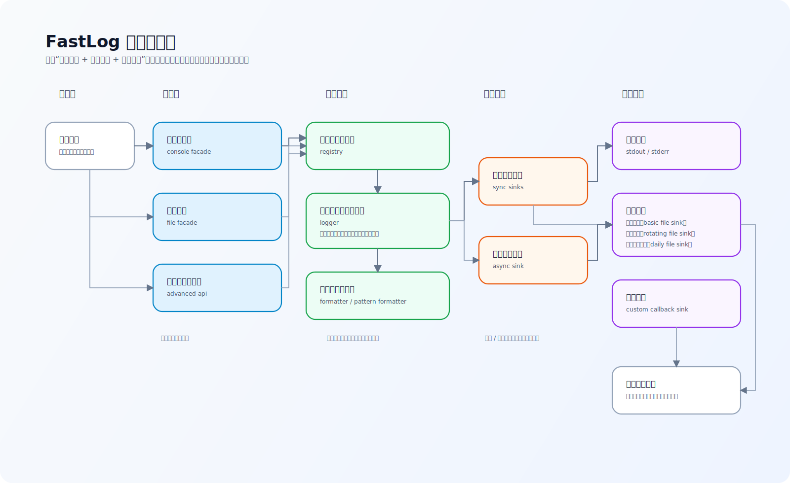
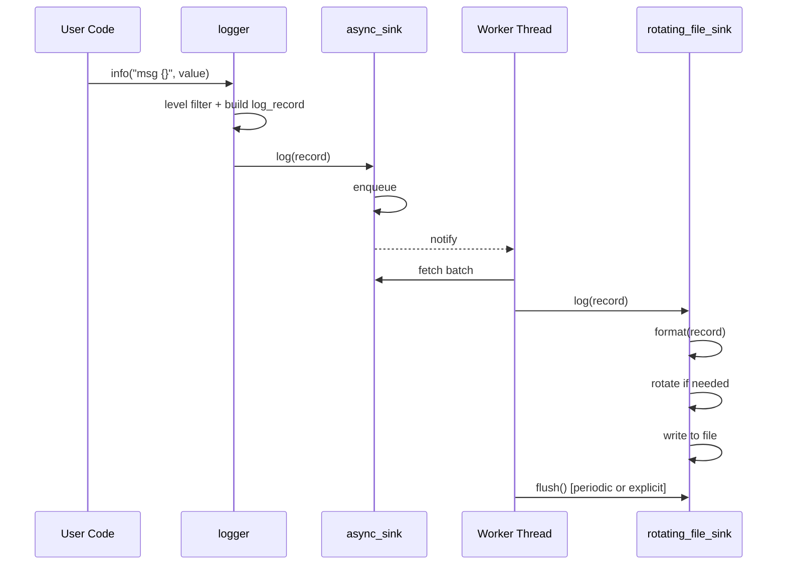

# FastLog

[](./LICENSE)    

面向现代 C++23 的纯 `header-only` 日志库，提供开箱即用的基础日志接口，以及可扩展的 `logger + sink + formatter + registry` 高级架构。

## 项目简介

FastLog 的定位是“默认简单、深入可扩展”的工程日志库。

- 基础场景下，只需要 `#include "fastlog/fastlog.hpp"`，即可直接使用 `fastlog::console` 和 `fastlog::file::make_logger(...)`
- 复杂场景下，可以继续使用多 sink、异步 sink、自定义 formatter、自定义 pattern、命名 logger 和全局 registry
- 项目采用纯头文件发布方式，便于直接集成到业务仓库

## 项目特点

- 纯 `header-only`
- 统一的 `snake_case` 风格 API
- 基础接口与高级接口并存
- 控制台与文件日志支持 `compact / standard / full`
- 源码位置仅支持两种模式：`filename / absolute`
- 支持 `basic_file_sink`、`rotating_file_sink`、`daily_file_sink`
- 支持 `async_sink` 与 `block / drop_oldest / drop_new`
- 支持完全自定义 `pattern`
- 支持 backtrace ring buffer
- 支持可选 `cpptrace`
- 支持 CMake 安装导出和 `fastlog::fastlog`

## 项目环境

- 构建系统：`CMake`
- 语言标准：`C++23`
- 依赖库：
  标准库
  `cpptrace`（可选，开启 `FASTLOG_WITH_CPPTRACE=ON` 时启用）

## 集成使用

推荐使用 `FetchContent`：

```cmake
include(FetchContent)

FetchContent_Declare(
    fastlog
    GIT_REPOSITORY https://github.com/superlxh02/FastLog.git
    GIT_TAG main
)

FetchContent_MakeAvailable(fastlog)

target_link_libraries(your_target PRIVATE fastlog::fastlog)
```

如果不需要栈追踪能力，可以关闭：

```cmake
set(FASTLOG_WITH_CPPTRACE OFF CACHE BOOL "" FORCE)
```

## 简单示例

```cpp
#include "fastlog/fastlog.hpp"

int main() {
    fastlog::set_console_level(fastlog::log_level::info);
    fastlog::set_console_detail_mode(fastlog::detail_mode::compact);

    fastlog::FileLoggerOptions options{
        .level = fastlog::log_level::debug,
        .detail_mode = fastlog::detail_mode::standard,
        .source_path = fastlog::source_path_mode::filename,
        .max_file_size = 1024 * 1024,
        .max_files = 5,
        .async_write = true
    };

    auto logger = fastlog::file::make_logger("app", "logs/app.log", options);

    fastlog::console.info("service started");
    logger.warn("listening on port {}", 8080);
    fastlog::file::flush(logger);
}
```

## 文档

- [接口说明文档](https://superlxh02.github.io/FastLog/)
- [设计文档](https://superlxh02.github.io/FastLog/design.html)

## 整体架构

### 设计思路

FastLog 采用“前端记录构造”和“后端输出管线”分离的思路。

- `console` 和 `file` facade 提供最简单的接入方式
- `registry` 统一管理默认 logger 和命名 logger
- `logger` 负责级别过滤、元信息采样、`log_record` 构造
- `formatter` 负责最终格式化
- `sink` 负责落地输出
- `async_sink` 作为包装层，把业务线程与 I/O 解耦

### 架构图



完整设计文档见：[设计文档](https://superlxh02.github.io/FastLog/design.html)
接口说明文档见：[接口说明文档](https://superlxh02.github.io/FastLog/)

### 时序图


```mermaid
sequenceDiagram
    participant App as User Code
    participant Logger as logger
    participant Async as async_sink
    participant Worker as Worker Thread
    participant File as rotating_file_sink

    App->>Logger: info("msg {}", value)
    Logger->>Logger: level filter + build log_record
    Logger->>Async: log(record)
    Async->>Async: enqueue
    Async-->>Worker: notify
    Worker->>Async: fetch batch
    Worker->>File: log(record)
    File->>File: format(record)
    File->>File: rotate if needed
    File->>File: write to file
    Worker->>File: flush() [periodic or explicit]
```

## 更多示例

- [simple_example.cpp](/Users/lxh/workspace/cpp/FastLog/example/simple_example.cpp)
  展示基础终端输出、输出模式切换、基础文件写入和自定义 pattern
- [advanced_example.cpp](/Users/lxh/workspace/cpp/FastLog/example/advanced_example.cpp)
  展示多 sink、高级组合、异步文件写入、异常日志和 backtrace
